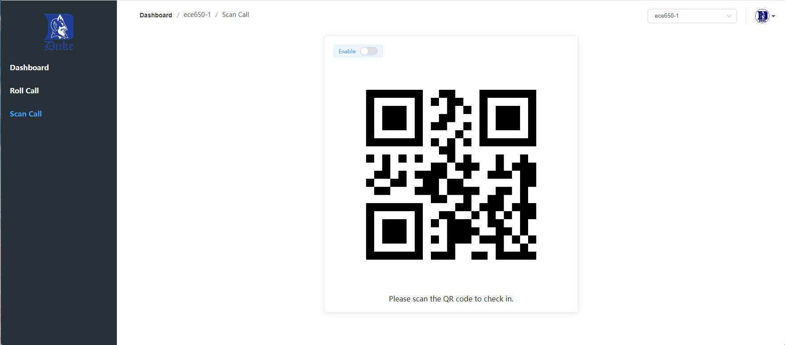

# Attendance
A school (Duke) attendance system built with Vue.

## Demo
### Faculty / Student Dashboard (on PC)
[https://lyuanzhi.github.io/Attendance](https://lyuanzhi.github.io/Attendance) (Open in PC)
### Student QR Code Scan (on Mobile)
[https://lyuanzhi.github.io/Attendance](https://lyuanzhi.github.io/Attendance) (Open in Mobile)
```
Faculty:
netID: lg222
password: 1
------------
Student:
netID: nh666
password: 1
```

**The system will detect the user's device. If it is a mobile device, it will display Student QR Code Scan Page; If it is a PC, it will display Dashboard Page.**

## Tech Stack
1. Docker
2. MySQL
3. MyBatis
4. Redis
5. Vue
6. Spring Boot
7. Gradle
8. Node.js

## Dependencies
```
Java: 17.0.10
Gradle: 7.3.3
Node.js: 14.x
MySQL: 8.0.34
Redis: 3.2.12
./attendance-back/build.gradle
./attendance-cli/package.json
```

## Install / Build
Just follow the instructions in ```./.github/workflows``` and ```./attendance-back/Dockerfile```.

## Node.js Run and Build
1. ```npm run serve```
2. ```npm run build```

## Gradle Run and Build
1. ```./gradlew bootrun```
2. ```./gradlew bootjar```

## Deploy
Most things are automated through CI/CD workflows.

### Front-end: GitHub Pages
There are two things to note:
1. You should give the workflow permission to create a new branch.

2. You should add ```vue.config.js``` which configures the ```publicPath```.
```
module.exports = {
  publicPath: '/Attendance/'
};
```

### Back-end: Google Cloud
1. Install MySQL / Redis / Java / Docker
2. Run ```sudo docker pull lyuanzhi/attendanceback:v1```
3. Run ```sudo docker run -d -p 8090:8090 lyuanzhi/attendanceback:v1```

#### Docker SSL Configuration
The steps are exactly the same as when you don't use docker.

#### Docker Common Commands
1. docker images
2. docker rmi imageId
3. docker ps -a
4. docker rm containerId
5. docker logs containerId (Very Useful When Debugging)

## Functionality
### Login Page
In the Login Page, you can choose to login to the faculty dashboard or student dashboard. Note that faculty can only login to the faculty dashboard and students can only login to the student dashboard.

### Faculty Dashboard Page
The Faculty Dashboard Page displays the number of enrolled students, attendance rate and tardiness rate of the selected section on the top half. The attendance rate shows the percentage of present and tardy; the tardiness rate shows the percentage of tardy. On the bottom half, overall attendance distribution is shown using histogram, where the percentages of PRESENT, ABSENT, and TARDY of all students are shown respectively.

### Faculty Roll Call Page
The Faculty Roll Call Page displays a table that shows all the students in the selected section with netId, display name, and attendance status.
1. Change Attendance Status: Each row of the table has a drop-down box that can be used to change the attendance status of each student. when you change the value of the drop-down box, the attendance status of the corresponding student will be changed immediately, without the need for an additional submit operation.
2. Enable/Disable Change Display Name: There is a switch button to enable or disable the change display name operation.
3. Change Display Name: Each row of the table has a button that can be used to change the display name of each student. When you click that button, you can change the display name directly on the display name column. After changing, you can choose to save or cancel the change.
4. Search: Above the student list table, there is a search section where you can search the student and attendance status based on the netId and the date.
5. Export: When you click the "Export" button, a dialog box will pop up asking if you want to export in json or xml format. When you select any one of these two, the corresponding attendance report file for faculty will be downloaded.

### Faculty Scan Call Page
The Faculty Scan Call Page will display the QR code which can be scanned by the student for taking attendance. There is a "Enable" switch button used to start the taking attendance process. Before you switch the button to enable, the QR code will have the content "Not Start Yet!"; After you click that button, the QR code will refresh every 3 seconds with a json containing all necessary information for taking attendance and a random code; When you switch the button to disable again, the QR code will stop refreshing and have the content "You Are Too Late!", and all the students of that section that didn’t scan the QR code to take attendance will be recorded as absent at that date.

**In all the Faculty pages, there is a drop-down button for section selection and a logout button. For the section selection button, when you change the section, all the related data will be refreshed.**

### Student Dashboard Page
The Student Dashboard Page haves a table to show all the sections he/she has, and their related notification status. Each row of the table has a drop-down box that can be used to change the notification status of each section. In addition, there is an "Export" button. When you click the "Export" button, a dialog box will pop up asking if you want to export in json or xml format. When you select any one of these two, the corresponding attendance report file for students will be downloaded.

### Scan Page
The Scan Page is used on the student's phone. In this page, the longitude and latitude of current position will be displayed; the distance between the phone and classroom, and its tolerance will be shown. Only when the distance is lower than 100 meters, the camera can be used to scan the QR code. Before scanning, you should enter your netId first.

## Demo Screenshots
### Login Page


### Faculty Dashboard Page


### Faculty Roll Call Page


### Faculty Scan Call Page


### Student Dashboard Page


### Student Mobile Scan Page

